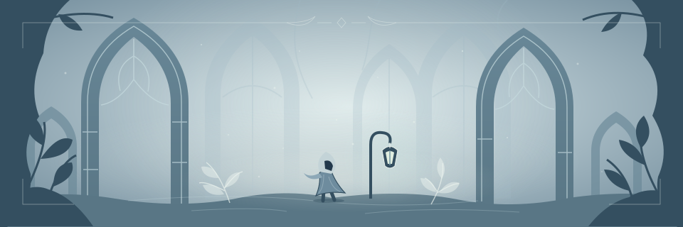

<picture>
  <source media="(prefers-color-scheme: dark)" srcset="assets/banner-dark.svg">
  <source media="(prefers-color-scheme: light)" srcset="assets/banner-light.svg">
  
</picture>

# Ahoy, I'm Christian 👋

**Tech Lead. Game maker after hours. Anime fan.**

### Currently building

An open-world 2D MMORPG with turn-based tactical battles.

### Tech I work with

- **Backend:** Java, Spring, Python, Go
- **Systems:** C, C++
- **Data:** PL/SQL
- **Games:** Godot
- **Web:** Angular
