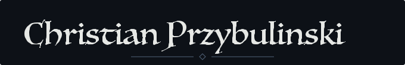
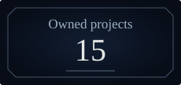

  

  

<h3 align="center">Ahoy.</h3>

Welcome to my Lair

  

  
   
  

  

  An open-world 2D MMORPG 
  with turn-based tactical battles.

  

  
  
  
  
   
  
  
  
  
   
  
  

  
  
  

GitHub activity · Including private work Updated automatically by GitHub Actions

