

  

<h2 align="center">Christian Przybulinski</h2>
<h3 align="center">Ahoy.</h3>

  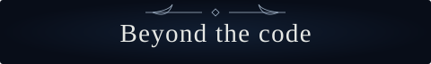

  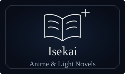
  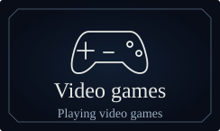 
  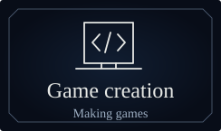
  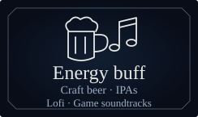

  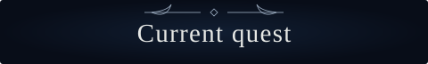

  An open-world 2D MMORPG 
  with turn-based tactical battles.

  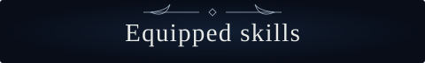

  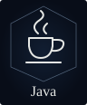
  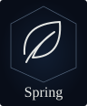
  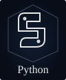
  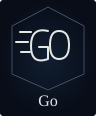
  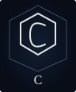 
  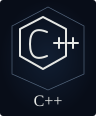
  
  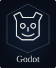
  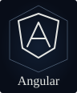
  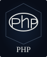 
  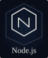
  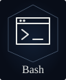

  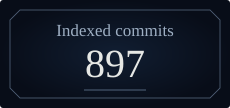
  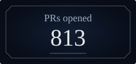

2026 · Including private work GitHub search snapshot · October 8, 2026 · Manually updated

